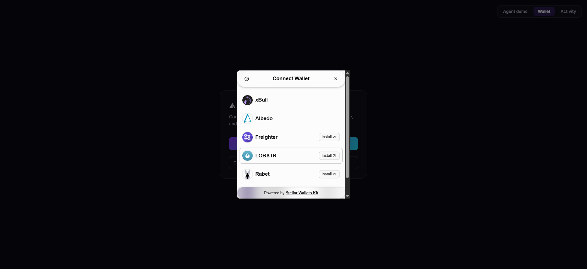
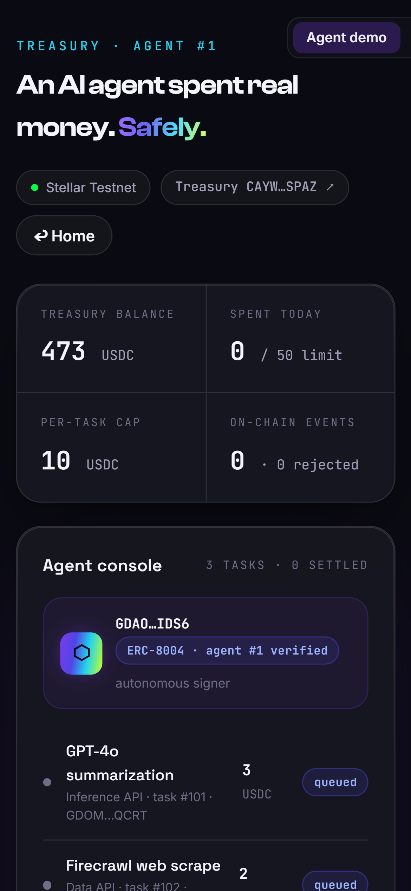
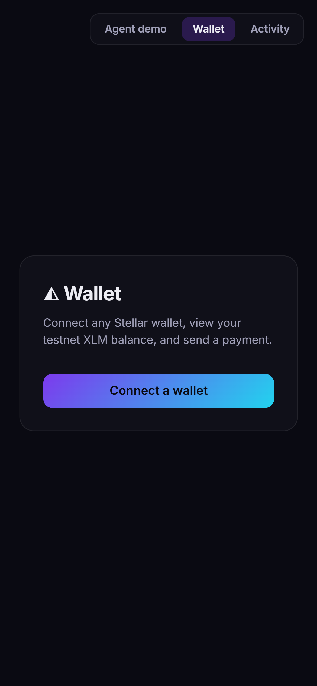
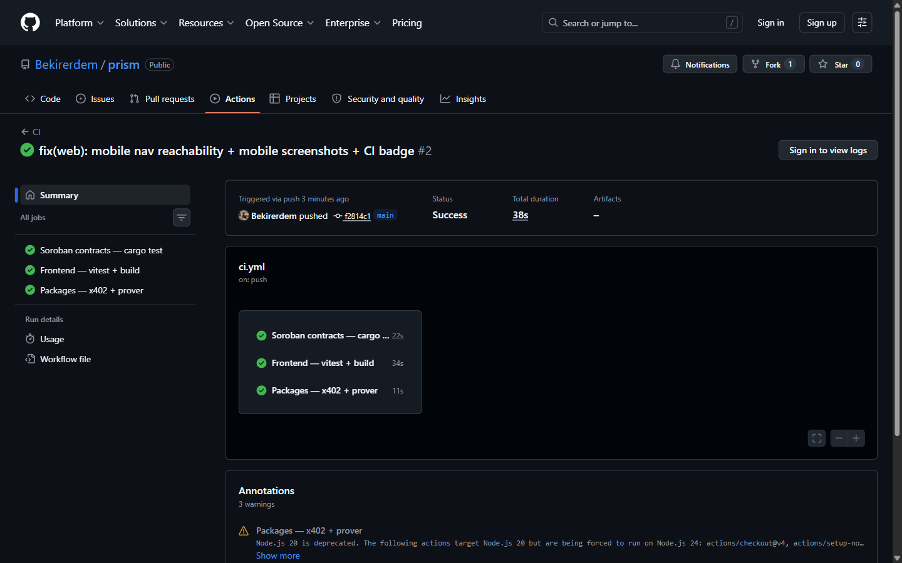

<div align="center">

# ◭ Prism

### The wallet your AI agent can't drain.

A non-custodial Soroban treasury that lets a business hand an autonomous AI agent **real money to spend** — where the **contract**, not the model's good behaviour, enforces the limits. Every payment is auto-accounted, and Stellar settles in sub-cents.

[](https://github.com/Bekirerdem/prism/actions/workflows/ci.yml)


**[▶ Live demo](https://web-five-psi-7iqrhfurdh.vercel.app) · [🎤 Pitch deck](https://deck-bice-omega.vercel.app) · [🔗 Contract on Stellar Expert](https://stellar.expert/explorer/testnet/contract/CAYWNXHANRY5GSJAZOR4YTKBKNOKTCITE52ZRKDKCAWLDTYWFFVFSPAZ) · [📄 Deployment & proofs](DEPLOYMENT.md)**


</div>

---

## 🏆 Built during Stellar Hacks: Real-World ZK

Prism's bounded-treasury core predates this hackathon (built at IBW 2026). **Everything zero-knowledge — Prism's entire Confidential layer — was designed and built inside the Stellar Hacks: Real-World ZK window (June 18–22, 2026)**, and is the focus of this submission:

| Date | Built this hackathon |
|---|---|
| Jun 18 | Confidential ZK design spec |
| Jun 19 | Compliance **circuit** (Circom/BN254): per-task range + daily-sum bounds · `Poseidon` commitments · Poseidon-Merkle whitelist membership · Groth16 trusted setup (Hermez ptau) · **on-chain BN254 verifier + attestation** (`CCOLX7NE…`) |
| Jun 21 | **Hardened verifier** — anchored-policy binding + replay guard, with a live replay-rejected proof on testnet · CSPRNG commitment salt (closed a hiding break) |
| Jun 22 | **Confidential-mode demo** on the dashboard — commitments + proof + the live attested tx |

Also built in this window (the open-economy trust layer): reputation-gated payees, outcome-bound escrow, and the bounded x402 buyer. Every item is in the git history and verified on testnet (links throughout this README).

---

## TL;DR

- **Bound** — the agent physically can't overspend or pay the wrong address; the contract rejects violations **on-chain**.
- **Account** — every payment is tracked per task in the contract, attributable with zero overhead.
- **Fund** — earmark a budget per agent via zero-cost Stellar **muxed sub-addresses** — no memos, no new accounts.
- **Trust + outcome** — pay any agent above an earned **reputation** threshold (not just a static whitelist), **escrow** funds for pay-on-delivery, and cap an agent's **x402** pay-per-use API spend.
- **Prove (ZK)** — confidential mode proves the agent stayed within policy in zero-knowledge, [verified on-chain](https://stellar.expert/explorer/testnet/tx/4438c94952d6d06fbf6b205e07be1c28ea33c5e1422a5323e93572788b9cac2a), revealing no amount or payee.
- **Live** — deployed on Stellar testnet, paying real USDC and rejecting real exploits. `cargo test -p treasury` → **14/14**.

## The problem

AI agents can reason, plan, and act — right up until they need to **pay** for something. Today no business gives an LLM agent a wallet, for two reasons:

1. **Safety.** One hallucination, jailbreak, or prompt-injection and the wallet is drained.
2. **Accounting.** An agent that makes hundreds of small payments is impossible to reconcile.

So agents "research and recommend" but never actually transact. **Prism removes the blocker.**

## What Prism does

| | Guarantee | How |
|---|---|---|
| **Bound** | The agent can't overspend or pay the wrong address | Soroban contract enforces a policy (payee whitelist · per-task limit · daily limit) and **rejects violations on-chain** |
| **Account** | Every payment is attributable, with zero overhead | Spend is tracked **per task** in the contract; read straight off-chain |
| **Fund** | Earmark money for a specific agent budget with no memos | A pool account issues **zero-cost muxed sub-addresses**; deposits are attributed by `to_muxed_id` |
| **Trust** | The agent can pay *new* counterparties safely, not just a static list | Payee passes if **whitelisted OR** its on-chain ERC-8004 **reputation ≥ threshold** |
| **Outcome** | Pay only for delivered work | **Escrow** locks funds; released on approval, refunded after a deadline |

The business keeps custody the whole time — funds live in the owner's own Soroban contract. Prism is the **guardrails + accounting + rail**, never the custodian.

## How it works

The agent signs its own `pay(task, to, amount)`. The contract runs the policy gate, in order, on **every** call:

```
1. agent.require_auth()              only the registered agent can spend
2. amount > 0                        else  InvalidAmount        (#1)
3. payee whitelisted OR reputation≥min  else  PayeeNotWhitelisted / BelowReputation (#2/#5)
4. amount ≤ per-task limit           else  ExceedsTaskLimit     (#3)
5. day_spent + amount ≤ daily limit  else  ExceedsDailyLimit    (#4)
6. record spend, THEN transfer       (checks-effects-interactions — reverts atomically)
```

A prompt-injected "drain to attacker" payment is signed by the agent and still **bounces** at step 3 — funds never move.

```
          fund (muxed M-addr, per budget)            agent pays vendor (USDC)
   client ───────────────► POOL (G) ──► owner    AGENT ──► [ pay(task,to,amt) ]
                            to_muxed_id            (signs)         │
                            attribution                            ▼
                                                  ┌──────────────────────────────┐
                                                  │  PRISM TREASURY (Soroban)     │
                                                  │  • policy: whitelist / per-   │
                                                  │    task / daily limit         │
                                                  │  • rejects violations on-chain│
                                                  │  • per-task accounting + event│
                                                  │  USDC stays here (owner's)    │
                                                  └──────────────┬───────────────┘
                                                                 ▼  USDC transfer
                                                              VENDOR
   trust layer:  ERC-8004 identity + reputation-gated payees (live) · escrow · x402  ·  trionlabs/stellar-8004
```

## Confidential mode — same guarantees, zero disclosure (ZK)

Prism's policy gate is transparent: today every `pay` reveals the payee and amount on-chain. **Prism Confidential** adds a zero-knowledge layer so a business can *prove its agent obeyed policy without revealing what it spent, on what, or with whom.*

Each payment is hidden behind a commitment `C = Poseidon(amount, payee, salt)`. A single **Groth16 proof — verified on-chain by a Soroban contract** — attests over a batch that:

```
∀i  amount_i ≤ per-task limit        (range proof)
    Σ amount_i ≤ daily limit         (aggregate bound)
∀i  payee_i ∈ whitelist              (Poseidon Merkle membership)
∀i  C_i = Poseidon(amount_i, payee_i, salt_i)   (commitment binding)
```

No amount or payee is ever revealed — only the commitments and the proof go on-chain. The contract runs the BN254 pairing check and emits `ComplianceAttested(whitelist_root, period_id)`. **Verified live on testnet:** [on-chain verify tx](https://stellar.expert/explorer/testnet/tx/4438c94952d6d06fbf6b205e07be1c28ea33c5e1422a5323e93572788b9cac2a) · verifier [`CCOLX7NE…DBRH`](https://stellar.expert/explorer/testnet/contract/CCOLX7NEBDJRRVTPFVSK3UJLHMG3HO4UVYJW3NFBOTUG7Q7GOP63DBRH).

- **Circuit** — Circom (BN254), `circomlib` Poseidon + Merkle + range proof. `npm test` in `circuits/` → **5/5**.
- **On-chain verifier** — `soroban-verifier-gen --curve bn254`, wrapped with a raw-bytes ABI + **anchored-policy binding + replay guard** + attestation event. `cargo test -p compliance_verifier` → **4/4**.
- **Proving** — snarkjs Groth16 over the public Hermez powers-of-tau; off-chain `snarkjs verify` is the documented fallback.

> **Honesty note.** The ZK hides Prism's *compliance ledger* — Prism's storage and events carry only commitments and a proof, never plaintext amounts or payees. Transfer-level privacy (hiding the underlying USDC movement at the token layer) is the shielded-pool roadmap; for the demo, real fund movement is shown in the contrasting transparent "public mode".

## Trust, outcomes & x402

Three upgrades take Prism from a walled garden to the open agent economy — each enforced by the same contract, all live on testnet ([proofs](DEPLOYMENT.md)).

- **Reputation-gated payees.** The payee gate is no longer a static whitelist: a payment clears if the payee is whitelisted **OR** its on-chain reputation ≥ a threshold the owner sets — so an agent can safely pay *new* counterparties it was never pre-approved for. Reputation is read cross-contract from an ERC-8004-style registry. [Live: a non-whitelisted reputable payee paid on-chain](https://stellar.expert/explorer/testnet/tx/8d62132f4940f71758a351e68c8a7fe0f24b14207abf8c9c3eed6b3842c215cb).
- **Escrow (pay-on-delivery).** `create_escrow` locks funds for a payee against a task — reserved in the treasury, not moved. The owner `release`s them on approval (daily limit + accounting applied at the real outflow), or the agent `refund`s after a deadline (the lock returns to the free balance, nothing paid). [Live: release](https://stellar.expert/explorer/testnet/tx/df742d987d85efb517a164b68e36c9302c4daf623c15dcaf416c73cbb26f6c4b) · [refund](https://stellar.expert/explorer/testnet/tx/b545aeb489e8e36f73b195f299b5926f2387979cd71701bb428a8b099a718e46).
- **Bounded x402.** When an agent hits an [x402](https://developers.stellar.org/docs/build/agentic-payments/x402) `402 Payment Required`, `packages/x402` gates the payment against the treasury policy first and only settles through the bounded treasury's `pay()` if it passes — the agent can't be tricked into an over-limit or wrong-payee x402 payment. [Live: an in-policy x402 payment settled on-chain](https://stellar.expert/explorer/testnet/tx/8a1a887ac32b700d7e2ad2d28d64760003529c8d804be600891b162eba8ada1a); an over-limit one is gated off-chain before it ever reaches `pay()`. `npm test` → **11/11**.

`cargo test -p treasury` → **14/14** (6 core + 3 reputation + 5 escrow).

## Why Stellar

- **Sub-cent, deterministic fees** make agent micro-payments economical (gas would kill this).
- **Muxed accounts** — one account, infinite zero-cost sub-addresses — are the attribution primitive for swarms of agent payments. No equivalent is this cheap elsewhere.
- **Native account abstraction** (`__check_auth`) makes a contract-bounded agent first-class.
- **Native USDC** + path-payment + anchors connect the agent to the real world.

## Try the live demo

**→ [web-five-psi-7iqrhfurdh.vercel.app](https://web-five-psi-7iqrhfurdh.vercel.app)** (Stellar testnet, no wallet needed)

1. **Run agent tasks** — the agent autonomously settles 3 vendor payments in USDC. No wallet popup; it signs its own transactions. Each lands with a real Stellar Expert tx link.
2. **Simulate prompt-injection** — tell the agent to send funds to an unapproved wallet. The contract **rejects it on-chain** (`PayeeNotWhitelisted`). Funds never move. 🔴
3. **Confidential mode (ZK)** — the same payments shown as `Poseidon` commitments: amount and payee hidden, yet proven within policy and **attested on-chain** (live verify tx). 🔒
4. **Auto-reconciled spend** — per-task accounting, read straight from the contract.
5. **Funding rail** — fund a budget via its zero-cost muxed sub-address; the deposit is attributed on-chain with no memo.

## Live on testnet

| Contract | Address |
|---|---|
| Prism Treasury | [`CAYWNXHA…SPAZ`](https://stellar.expert/explorer/testnet/contract/CAYWNXHANRY5GSJAZOR4YTKBKNOKTCITE52ZRKDKCAWLDTYWFFVFSPAZ) |
| USDC (SAC) | [`CDCEHPK4…3Y2W`](https://stellar.expert/explorer/testnet/contract/CDCEHPK4OJXVRA4JV7N56GR5SRD5KGGZ55BDSHKODGR72Y4KGS6A3Y2W) |
| Funding pool | [`GD2NZKSM…3427`](https://stellar.expert/explorer/testnet/contract/GD2NZKSMQW367OIFXRM4NP7RIW6YLDZLJ4C7253MDOKCFC4Q4IOO3427) |
| ERC-8004 Identity Registry | [`CDE3K4CO…FIWZH`](https://stellar.expert/explorer/testnet/contract/CDE3K4COIAGWNNJQQLL26SYI3KBJF5FUDHXG5FA6GYDJCG7T5V7FIWZH) — agent #1 registered |
| **Treasury v2** (reputation + escrow) | [`CDKQGDPL…XT5H`](https://stellar.expert/explorer/testnet/contract/CDKQGDPLRX6DOCQTI5KVMZNGMPKMSRNGJRVCQ7LAAQGB2S5JKDCHXT5H) |
| **Compliance Verifier** (ZK) | [`CCOLX7NE…DBRH`](https://stellar.expert/explorer/testnet/contract/CCOLX7NEBDJRRVTPFVSK3UJLHMG3HO4UVYJW3NFBOTUG7Q7GOP63DBRH) |
| Reputation Oracle (8004 stand-in) | [`CCJFIEYF…INKY`](https://stellar.expert/explorer/testnet/contract/CCJFIEYFNPRTJVCOGOSESYC5Z6FHHHYAH36V7QTZEDPKESY6O5TPINKY) |

The first treasury is the transparent "public mode" demo; **Treasury v2** adds the reputation gate + escrow. Full addresses + verified on-chain results: [`DEPLOYMENT.md`](DEPLOYMENT.md).

## Quickstart

```bash
# 1. Contract — test & build (already deployed; this is optional)
cargo test  --manifest-path contracts/treasury/Cargo.toml   # 14/14 passing
stellar contract build --manifest-path contracts/treasury/Cargo.toml

# 2. Frontend — landing + live dashboard
cd web
npm install
npm run dev        # opens on http://localhost:5173 (or the next free port)
```

The dashboard reads live testnet state, and the embedded agent key (testnet-only, zero value) lets the agent sign its own payments — that's the whole point: **the contract is the safety, not a human clicking approve.** A build-time guard refuses to load the bundled key on any non-testnet network.

The **Wallet** tab (top-right nav) is a self-contained Stellar dApp — connect/disconnect **any Stellar wallet** (Freighter · xBull · Albedo · LOBSTR · Rabet · Hana, via [**StellarWalletsKit**](https://stellarwalletskit.dev/)), view your testnet **XLM balance**, and **send an XLM payment** with success/failure + tx-hash feedback. It surfaces three error types (wallet not installed · request rejected · insufficient balance) and is also the foundation of Prism's per-user login (*connect your wallet = your account*).

### Screenshots

**Multi-wallet connect — StellarWalletsKit** (Freighter · xBull · Albedo · LOBSTR · Rabet · Hana):



**Connected wallet → balance → a confirmed payment, verified on-chain:**

| Connected · balance · confirmed payment | Payment successful on Stellar Expert |
|:---:|:---:|
|  |  |

**Mobile responsive** (390 px):

| Agent dashboard | Wallet |
|:---:|:---:|
|  |  |

**Continuous integration** — every push runs three jobs: Soroban contracts (`cargo test`), frontend (Vitest + build), and the x402 + prover package tests.



## Project structure

```
contracts/treasury/             Soroban bounded treasury — bound/account/fund + reputation gate + escrow (+ 14 tests)
contracts/compliance_verifier/  on-chain BN254 Groth16 verifier (ZK) + attestation (+ 2 tests)
contracts/reputation_oracle/    ERC-8004-style reputation registry (stellar-8004 stand-in)
circuits/                       Circom compliance circuit + circomkit tests + trusted setup
packages/treasury-client/       generated TypeScript client
packages/prover/                snarkjs → Soroban byte encoder + proof fixtures
packages/x402/                  bounded x402 buyer (gate an x402 payment, settle via the treasury)
web/                            landing + live dashboard (Vite · React 19 · TS)
deck/                           pitch deck (self-contained spectral slides)
DEPLOYMENT.md                   live testnet addresses & verified results
docs/                           narrative + assets, design spec & plan
```

## Tech stack

- **Contract:** Rust / `soroban-sdk` 26 (Soroban, Stellar testnet)
- **Confidential (ZK):** Circom + `circomlib` (BN254) · snarkjs Groth16 · on-chain verifier via `soroban-verifier-gen` (`bn254_multi_pairing_check`)
- **Client:** `stellar contract bindings typescript` → typed client
- **Frontend:** Vite + React 19 + TypeScript, framer-motion, cinematic dark design (Stellar-yellow accent)
- **Trust + rails:** ERC-8004 agent identity + **reputation-gated payees (live)** ([trionlabs/stellar-8004](https://stellar.expert/explorer/testnet/contract/CDE3K4COIAGWNNJQQLL26SYI3KBJF5FUDHXG5FA6GYDJCG7T5V7FIWZH) in production; a stand-in oracle on testnet); **escrow** for pay-on-delivery; a **bounded x402** buyer that caps an agent's pay-per-use API spend.

## Security

- **Non-custodial** — USDC never leaves the owner's own contract; Prism cannot move funds outside the policy.
- **Checks-effects-interactions** — accounting is written before the transfer, so a failed/reentrant transfer reverts the whole call atomically.
- **No front-runnable init** — the policy is set atomically in the constructor at deploy time.
- **Testnet-only key** — the demo's embedded agent key holds no real value, and a config guard blocks loading it on any non-testnet network.

## Team

- **Bekir Erdem** — contract & engine (the Soroban treasury and core).
- **Seyit Ali Değirmen** — money system & the screen (muxed funding rail + UX).

## License

[MIT](LICENSE) © 2026 Bekir Erdem · Seyit Ali Değirmen
